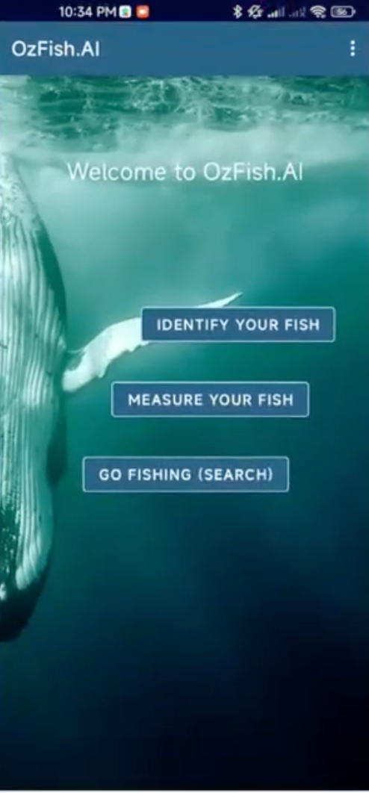

# OzFish.AI — AI Fish Identification & Sizing for NSW

> Android app that lets recreational fishers photograph a catch to identify its
> species and measure its length, helping keep their fishing compliant with NSW
> size regulations.
>
> **Master's Capstone Project · Led a six-person team · Ranked Top 1 in cohort**

`InceptionV3` · `Transfer Learning` · `Keras` · `TensorFlow Lite` · `Android` · `AR`

  

## Problem
Recreational fishers sometimes unknowingly catch fish that belong to a protected
species or don't meet size criteria, which harms the marine ecosystem and can lead
to fines. Existing fish-identification apps often fall short in accuracy.

## Solution
With OzFish.AI, users snap a photo of their catch to instantly learn its species and
size, helping keep their fishing compliant. Three features:

| Feature | What it does |
|---|---|
| **Fish.Identify** | Identifies any of **68 NSW fish species** from the camera — **top-5 accuracy 90.22%** |
| **Fish.Measure** | Uses **AR** to measure catch length against NSW size regulations |
| **Fish.Search** | Looks up a database covering **74 NSW fish species** |

## How it works
1. **Data** — the WildFish and NSWFish datasets, each split 60% train / 20% validation / 20% test.
2. **Model** — trained an **InceptionV3** network via transfer learning (Keras); best model + weights saved to `.h5`.
3. **Deploy** — converted to **TensorFlow Lite** (`InceptionV3_weights02.tflite`) and integrated it, with `labels.txt`, into the Android app.
4. **Measure** — AR estimates catch length, combined with recognition to check against NSW size regulations.

This project also contributes a comprehensive NSW fish-species dataset for future studies.

## Demo
**[App demonstration videos](https://drive.google.com/drive/u/0/folders/13NMRPDizouPpJL1hRPQVtX--I5rPQ7R6)**
· APK in [`APK & Demonstration Videos/`](./APK%20%26%20Demonstration%20Videos)

## Repository structure
    Fish classification algorithm/
    ├── InceptionV3_FinalModel.py               # train InceptionV3, save best model, export TFLite
    ├── split_train_validation_test_nswfish.py  # 60/20/20 dataset splitting
    ├── split_train_validation_test_wildfish.py
    ├── labels.txt                              # NSW species labels for the app
    └── README.txt                              # step-by-step training guide
    APK & Demonstration Videos/                 # installable APK + demo videos

## Reproduce
Steps (from `Fish classification algorithm/README.txt`):
1. Download the WildFish and NSWFish datasets (links in that README).
2. Run the `split_train_validation_test_*.py` scripts to build the 60/20/20 splits.
3. Run `InceptionV3_FinalModel.py` to train; test accuracy prints after running, model exports to `.tflite`.
4. Integrate the `.tflite` file and `labels.txt` into the Android application.

## Tech
Python · Keras · TensorFlow Lite · InceptionV3 · Android · AR

## Team & role
Master's Capstone Project — I led a six-person team; the capstone ranked Top 1 in the cohort.
